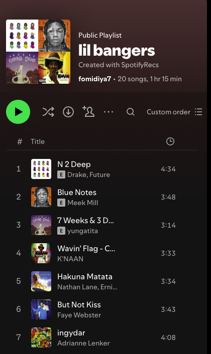
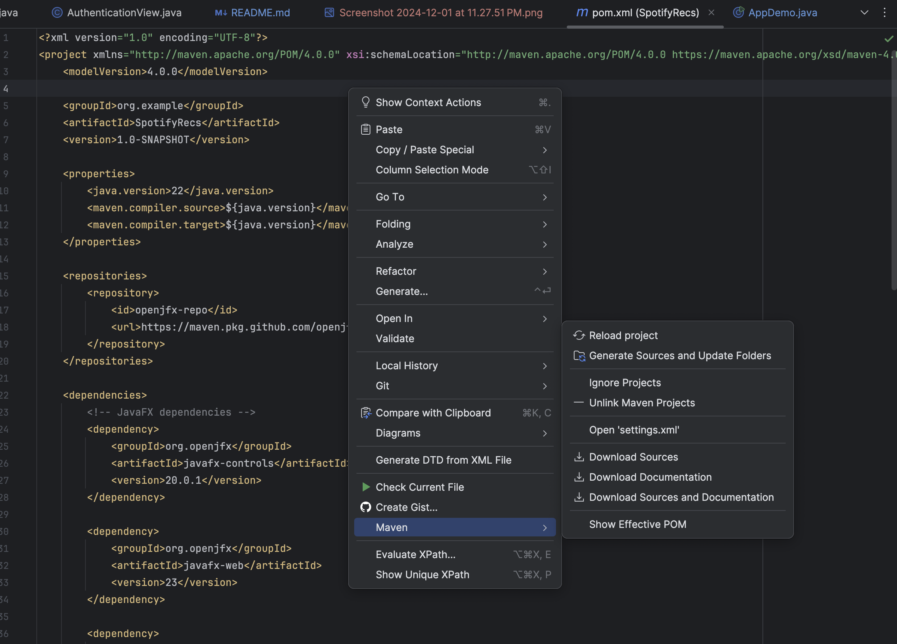
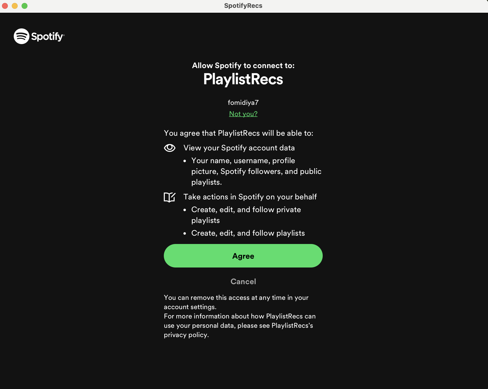

# SpotifyRecs

### **Team Members**:
- Sergio Sanchez Sergio-098
- Amazing Lawal lolamp4
- Fawaz Omidiya FawazOmidiya
- Justin Huang JustinHarvo

### **Project Purpose** 
- What Does SpotifyRecs Do:
    - SpotifyRecs allows users to generate a playlist of recommended songs based on various criteria inputs such as genre, artists, and tracks. The user will have the option to go to Spotify and listen to the created playlist as well as name, save, and revisit the playlist from the program in the future. 
- Why was SpotifyRecs Made?: 
  - Spotify Recs was made to help spotify users find more music to their liking based on their previous tastes, and to make it easily accessible on their spotify accounts.
- What Problem does SpotifyRecs Solve?
  - SpotifyRecs solves the issue of spotify users wanting to find newer songs, but not quite knowing exactly what they want to add, or which playlist or artists they want to base their recommendations on.
  User needs to generate a playlist based on their input criteria. The user runs the program, which takes a group of target genres, artists, and songs into account, along with their listening history and receives a new playlist personalized to their inputs. [Team story] 

### **Table of Contents**
1. [Team Members](#team-members)
2. [Project Purpose](#spotifyrecs)
3. [Table of Contents](#table-of-contents)
4. [Software Features](#software-features)
5. [Installation Instructions](#installation-instructions)
6. [Usage Guide](#usage-guide)
7. [License](#license)
8. [Feedback](#feedback)
9. [Contributions](#contributions)

### **Software Features**
1. Users would like to sign in and link their Spotify account to the program so that the program can access their listening history and modify / save playlists to their Spotify account. [Sergio's story]

2. Users would like to save the generated playlist to their collection. Users use the program to add the playlist to their collection which they can access on their Spotify account. [Sergio’s story]
    
4. User has a playlist they already enjoy, and want another playlist of similar songs. User runs the program and program generates a new playlist with similar new songs. [Fawaz’s story]

4. The user needs to input criteria into the recommendation algorithm. User sees genres and similar artists based on Constants provided in the code. User selects desired genres and similar artists to get more tailored recommendations. [Lola’s story]

5. User is not satisfied with the generated playlist. User removes song/songs they don't like from the playlist and the algorithm continues to find more recommended songs to fill the playlist. [Justin’s story]

### **Installation Instructions**
  In order to install and use this software, there ar eno extra packages or dependencies needed. You simply need to download the project and run the maven file SpotifyRecs/pom.xml. At that point you can run the App Builder and the Program will guide you from there.
  - Common Mistake: 
    - Forgetting the maven file. If you can not run the executable files, there is likely a problem with your maven file. Right-click the file and navigate to maven, and click reload project
      
  - This program can be run on any operating system.
### **Usage Guide**
  1. Log into the platform wih your spotify account, and proceed through the account verification process. Ensure to agree to allow SpotifyRecs to access your spotify account.
      
  2. Once verified, you will be prompted to provide all criteria you wish, including a list of songs, a list of artists, a list of genre's, or a sample playlist
### **License**
  Link To License:\
  
### **Feedback**
  - Feedback on SpotifyRecs is accepted and encouraged, and if you would like to get in contact and leave suggestions, please feel free to email fawaz.omidiya@mail.utoronto.ca, and we will get back with a response in a timely fashion.
  - When submitting feedback, please ensure to submit your name, contact info, and what suggestions you may have, as well as if you are a user or a fellow developer.
  - You can expect to hear a response in 3-5 business days.
### **Contributions**
  - If you would like to contribute to the project, please create a branch of the repository and make your changes as you wish. Then email your name and branch name to fawaz.omidiya@mail.utoronto.ca, as well as an explanation of your changes value to SpotifyRecs and implementation.
  - In order to fork this repo, you simply have to navigate to the fork button and make your fork, as it is open to all programmers. Once you receive a reply from a member of our team, you may make a pull request. In our response you will receive a request ID. Please include this RequestID in your pull request comments, or we can not validate your request.
  - If your contribution has addressed any and all concerns our team has pointed out, one of us will then merge your request into the main branch.

Users would like to sign in and link their Spotify account to the program so that the program can access their listening history and modify / save playlists to their Spotify account. [Sergio's story]

Users would like to save the generated playlist to their collection. Users use the program to add the playlist to their collection which they can access on their Spotify account. [Sergio’s story]

User has a playlist they already enjoy, and want another playlist of similar songs. User runs the program and program generates a new playlist with similar new songs. [Fawaz’s story]

The user needs to input criteria into the recommendation algorithm. User sees genres and similar artists based on Constants provided in the code. User selects desired genres and similar artists to get more tailored recommendations. [Lola’s story]

User is not satisfied with the generated playlist. User removes song/songs they don't like from the playlist and the algorithm continues to find more recommended songs to fill the playlist. [Justin’s story]
